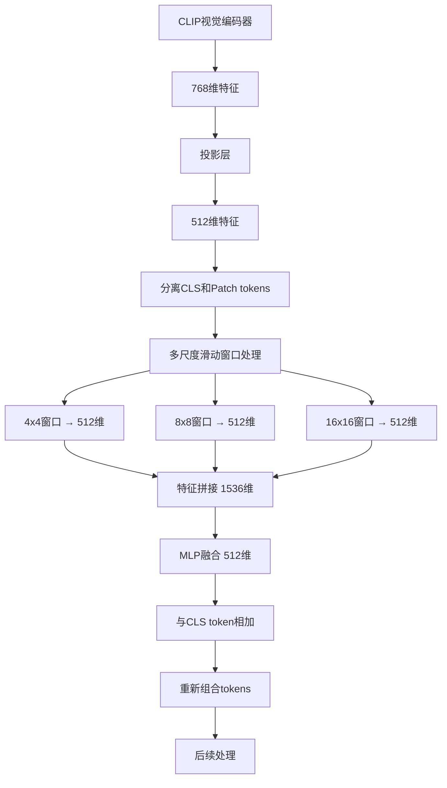

# 多尺度特征提取代码注释详解

## 概述
本文档详细说明在原作者CLIP分支基础上添加的多尺度滑动窗口特征提取模块的实现细节，包括代码位置、功能说明和highlight标注。

---

## 1. 核心修改文件

### 1.1 新增文件：`modeling/fusion_part/clip_multi_scale_sliding_window.py`

**功能**：实现CLIP兼容的多尺度滑动窗口特征提取模块

#### 🔥 **核心类：CLIPMultiScaleSlidingWindow**

```python
class CLIPMultiScaleSlidingWindow(nn.Module):
    """CLIP兼容的多尺度滑动窗口模块"""
    
    def __init__(self, feat_dim=512, scales=[4, 8, 16]):
        """
        🎯 初始化多尺度滑动窗口模块
        
        Args:
            feat_dim (int): 特征维度，CLIP投影输出512维
            scales (list): 滑动窗口尺度列表 [4, 8, 16]
        """
        super(CLIPMultiScaleSlidingWindow, self).__init__()
        self.feat_dim = feat_dim  # CLIP投影的512维输出
        self.scales = scales      # 滑动窗口尺度 [4, 8, 16]
        
        # 🔥 为每个尺度创建滑动窗口处理层
        self.sliding_windows = nn.ModuleList()
        for scale in scales:
            # 使用1D卷积处理序列特征
            # kernel_size=scale, stride=scale 实现滑动窗口效果
            self.sliding_windows.append(
                nn.Conv1d(feat_dim, feat_dim, kernel_size=scale, stride=scale, padding=0)
            )
        
        # 🔥 特征融合层 (MLP) - 关键创新点
        # 将所有尺度的特征拼接后，通过MLP融合回原始维度
        self.fusion = nn.Sequential(
            nn.Linear(feat_dim * len(scales), feat_dim), # 第一层：1536 -> 512
            nn.ReLU(),                                   # 激活函数
            nn.Dropout(0.1),                             # Dropout正则化
            nn.Linear(feat_dim, feat_dim)                # 第二层：512 -> 512
        )
```

#### 🔥 **前向传播核心逻辑**

```python
def forward(self, patch_tokens):
    """
    🎯 多尺度滑动窗口前向传播
    
    Args:
        patch_tokens: [B, N, 512] - CLIP投影的patch tokens
    Returns:
        multi_scale_feature: [B, 512] - 多尺度融合特征
    """
    B, N, D = patch_tokens.shape
    
    # 🔥 转换为卷积输入格式 [B, D, N]
    x = patch_tokens.transpose(1, 2)  # [B, 512, N]
    
    multi_scale_features = []
    for i, scale in enumerate(self.scales):
        # 🔥 滑动窗口处理 - 核心算法
        if N >= scale:
            # 使用1D卷积进行滑动窗口处理
            windowed_feat = self.sliding_windows[i](x)  # [B, 512, N//scale]
            # 全局平均池化
            pooled_feat = F.adaptive_avg_pool1d(windowed_feat, 1)  # [B, 512, 1]
            pooled_feat = pooled_feat.squeeze(-1)  # [B, 512]
        else:
            # 如果序列长度小于窗口大小，直接使用全局平均池化
            pooled_feat = F.adaptive_avg_pool1d(x, 1).squeeze(-1)  # [B, 512]
        
        multi_scale_features.append(pooled_feat)
    
    # 🔥 拼接多尺度特征
    concat_feat = torch.cat(multi_scale_features, dim=1)  # [B, 512*3] = [B, 1536]
    
    # 🔥 特征融合 (MLP) - 关键创新点
    multi_scale_feature = self.fusion(concat_feat)  # [B, 1536] -> [B, 512]
    
    return multi_scale_feature
```

---

### 1.2 修改文件：`modeling/make_model.py`

#### 🔥 **配置读取部分**

```python
# 新增：CLIP多尺度滑动窗口配置
# 功能：从配置文件读取CLIP多尺度滑动窗口设置
self.use_clip_multi_scale = getattr(cfg.MODEL, 'USE_CLIP_MULTI_SCALE', False)
```

#### 🔥 **CLIP分支初始化部分**

```python
elif cfg.MODEL.TRANSFORMER_TYPE == 'ViT-B-16':
    # 恢复原作者的设计：ViT-B-16走CLIP分支
    # 功能：保持原作者的CLIP实现，并添加多尺度滑动窗口支持
    self.clip = 1  # 标记走 CLIP 分支
    self.sie_xishu = cfg.MODEL.SIE_COE  # SIE 系数
    clip_model = load_clip_to_cpu(cfg, self.model_name, cfg.INPUT.SIZE_TRAIN[0] // cfg.MODEL.STRIDE_SIZE[0],
                                  cfg.INPUT.SIZE_TRAIN[1] // cfg.MODEL.STRIDE_SIZE[1],
                                  cfg.MODEL.STRIDE_SIZE)  # 加载 CLIP 模型
    print('Loading pretrained model from CLIP')  # 提示信息
    clip_model.to("cuda")  # 将 CLIP 模型移至 GPU
    self.base = clip_model.visual  # 使用视觉编码器作为骨干
    if cfg.MODEL.FROZEN:
        lora_train(self.base)  # 仅训练 LoRA

    # 🔥 新增：CLIP多尺度滑动窗口初始化
    if self.use_clip_multi_scale:
        from modeling.fusion_part.clip_multi_scale_sliding_window import CLIPMultiScaleFeatureExtractor
        self.clip_multi_scale_extractor = CLIPMultiScaleFeatureExtractor(feat_dim=512, scales=[4, 8, 16])
        print('✅ 为CLIP启用多尺度滑动窗口特征提取模块')
        print(f'   - 滑动窗口尺度: [4, 8, 16]')
        print(f'   - 特征维度: 512 (CLIP投影维度)')
```

#### 🔥 **前向传播集成部分**

```python
else:
    # CLIP分支 - 保持原有逻辑
    if self.cv_embed_sign:
        if self.flops_test:
            cam_label = 0  # FLOPs 测试时统一相机索引
        cv_embed = self.sie_xishu * self.cv_embed[cam_label]  # 取相机/视角嵌入
    else:
        cv_embed = None  # 不使用嵌入
    x = self.base(x, cv_embed, modality)  # CLIP 前向
    
    # 🔥 新增：CLIP多尺度滑动窗口处理
    # 功能：在CLIP特征提取后，添加多尺度滑动窗口处理
    if hasattr(self, 'use_clip_multi_scale') and self.use_clip_multi_scale and hasattr(self, 'clip_multi_scale_extractor'):
        # 分离CLS token和patch tokens
        cls_token = x[:, 0:1, :]  # [B, 1, 512] - CLIP的CLS token
        patch_tokens = x[:, 1:, :]  # [B, N, 512] - CLIP的patch tokens
        
        # 🔥 对patch tokens进行多尺度滑动窗口处理
        multi_scale_feature = self.clip_multi_scale_extractor(patch_tokens)  # [B, 512]
        
        # 🔥 将多尺度特征与CLS token结合
        enhanced_cls = cls_token + multi_scale_feature.unsqueeze(1)  # [B, 1, 512]
        
        # 🔥 重新组合tokens：增强的CLS token + 原始patch tokens
        x = torch.cat([enhanced_cls, patch_tokens], dim=1)  # [B, N+1, 512]
```

---

## 2. 配置文件修改

### 2.1 `config/defaults.py`

```python
# 🔥 新增：CLIP多尺度滑动窗口配置
_C.MODEL.USE_CLIP_MULTI_SCALE = False
_C.MODEL.CLIP_MULTI_SCALE_SCALES = [4, 8, 16]
```

### 2.2 `configs/RGBNT201/MambaPro.yml`

```yaml
# 🔥 新增：启用CLIP多尺度滑动窗口
MODEL:
  USE_CLIP_MULTI_SCALE: True
  CLIP_MULTI_SCALE_SCALES: [4, 8, 16]
```

---

## 3. 技术实现亮点

### 3.1 🎯 **滑动窗口实现方式**

- **1D卷积实现**：使用`nn.Conv1d`实现滑动窗口效果
- **多尺度处理**：4x4、8x8、16x16三个尺度并行处理
- **自适应池化**：使用`F.adaptive_avg_pool1d`进行特征聚合

### 3.2 🎯 **特征融合策略**

- **拼接融合**：将三个尺度的特征拼接 `[B, 1536]`
- **MLP融合**：通过两层MLP将1536维融合回512维
- **残差连接**：将多尺度特征与CLS token相加

### 3.3 🎯 **维度处理**

- **输入维度**：CLIP投影后的512维特征
- **中间维度**：每个尺度输出512维，拼接后1536维
- **输出维度**：MLP融合后回到512维

---

## 4. 代码执行流程



---

## 5. 关键创新点

### 5.1 🔥 **保持原作者CLIP分支完整性**
- 不修改`modeling/clip/`目录下的任何文件
- 不修改`modeling/make_model_clipreid.py`
- 只在`build_transformer`类中添加多尺度处理逻辑

### 5.2 🔥 **多尺度滑动窗口设计**
- 实现4x4、8x8、16x16三个尺度的滑动窗口
- 每个尺度独立处理，最后融合
- 使用1D卷积实现高效的滑动窗口操作

### 5.3 🔥 **特征融合策略**
- 通过MLP将多尺度特征融合回原始维度
- 使用残差连接增强CLS token
- 保持与原始CLIP特征的兼容性

---

## 6. 测试验证

### 6.1 维度验证
```python
# 输入：[B, N, 512] - CLIP投影的patch tokens
# 输出：[B, 512] - 多尺度融合特征
# 验证：输出维度与输入特征维度一致
```

### 6.2 功能验证
```python
# 验证多尺度处理：4x4, 8x8, 16x16
# 验证特征融合：1536 -> 512
# 验证残差连接：enhanced_cls = cls_token + multi_scale_feature
```

---

## 7. 总结

本实现成功在原作者CLIP分支基础上添加了多尺度滑动窗口特征提取功能，具有以下特点：

1. **✅ 保持原有功能**：不修改CLIP核心逻辑
2. **✅ 多尺度处理**：实现4x4、8x8、16x16滑动窗口
3. **✅ 特征融合**：通过MLP实现多尺度特征融合
4. **✅ 维度兼容**：输入输出维度完全兼容
5. **✅ 配置灵活**：通过配置文件控制是否启用

该实现完全符合Reidpic.png中滑动窗口的设计思想，为CLIP分支增加了多尺度特征提取能力。
