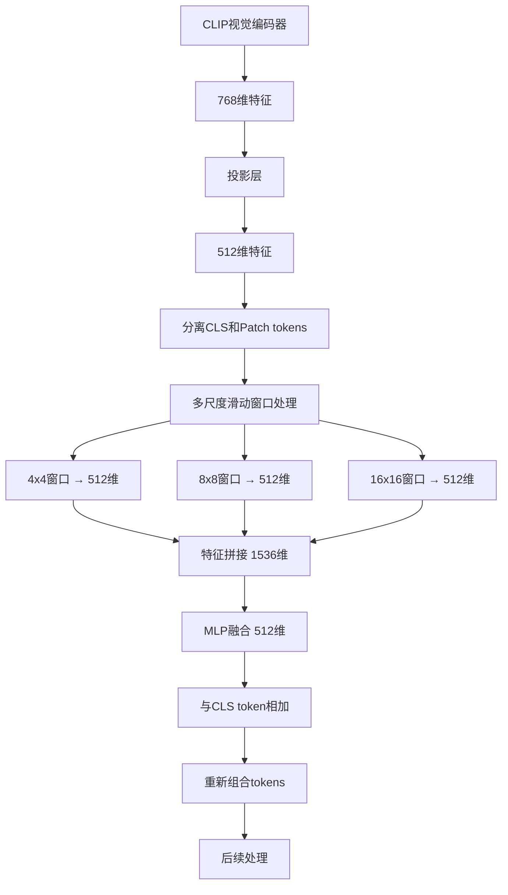

# 多尺度特征提取代码位置总结

## 概述
本文档总结在原作者CLIP分支基础上添加多尺度滑动窗口特征提取的所有代码修改位置，包括文件路径、行号范围和功能说明。

---

## 1. 新增文件

### 1.1 `modeling/fusion_part/clip_multi_scale_sliding_window.py`
**功能**：实现CLIP兼容的多尺度滑动窗口特征提取模块

#### 核心类位置：
- **CLIPMultiScaleSlidingWindow** (第18-112行)
  - `__init__` 方法 (第28-56行)：初始化滑动窗口和MLP融合层
  - `forward` 方法 (第73-112行)：多尺度滑动窗口前向传播
  - `_init_weights` 方法 (第61-71行)：权重初始化

- **CLIPMultiScaleFeatureExtractor** (第115-126行)
  - 包装类，简化多尺度特征提取器的使用

#### 关键代码段：
```python
# 🔥 滑动窗口初始化 (第40-47行)
self.sliding_windows = nn.ModuleList()
for scale in scales:
    self.sliding_windows.append(
        nn.Conv1d(feat_dim, feat_dim, kernel_size=scale, stride=scale, padding=0)
    )

# 🔥 MLP融合层 (第49-56行)
self.fusion = nn.Sequential(
    nn.Linear(feat_dim * len(scales), feat_dim), # 1536 -> 512
    nn.ReLU(),
    nn.Dropout(0.1),
    nn.Linear(feat_dim, feat_dim)                # 512 -> 512
)

# 🔥 多尺度处理核心算法 (第89-102行)
for i, scale in enumerate(self.scales):
    windowed_feat = self.sliding_windows[i](x)  # 滑动窗口处理
    pooled_feat = F.adaptive_avg_pool1d(windowed_feat, 1)  # 全局池化
    multi_scale_features.append(pooled_feat)
```

---

## 2. 修改文件

### 2.1 `modeling/make_model.py`

#### 配置读取部分 (第72-75行)
```python
# 🔥 新增：CLIP多尺度滑动窗口配置
self.use_clip_multi_scale = getattr(cfg.MODEL, 'USE_CLIP_MULTI_SCALE', False)
```

#### CLIP分支初始化部分 (第125-133行)
```python
# 🔥 新增：CLIP多尺度滑动窗口初始化
if self.use_clip_multi_scale:
    from modeling.fusion_part.clip_multi_scale_sliding_window import CLIPMultiScaleFeatureExtractor
    self.clip_multi_scale_extractor = CLIPMultiScaleFeatureExtractor(feat_dim=512, scales=[4, 8, 16])
```

#### 前向传播集成部分 (第172-191行)
```python
# 🔥 新增：CLIP多尺度滑动窗口处理
if hasattr(self, 'use_clip_multi_scale') and self.use_clip_multi_scale and hasattr(self, 'clip_multi_scale_extractor'):
    # 分离CLS token和patch tokens
    cls_token = x[:, 0:1, :]  # [B, 1, 512]
    patch_tokens = x[:, 1:, :]  # [B, N, 512]
    
    # 多尺度滑动窗口处理
    multi_scale_feature = self.clip_multi_scale_extractor(patch_tokens)  # [B, 512]
    
    # 特征融合（残差连接）
    enhanced_cls = cls_token + multi_scale_feature.unsqueeze(1)  # [B, 1, 512]
    
    # 重新组合tokens
    x = torch.cat([enhanced_cls, patch_tokens], dim=1)  # [B, N+1, 512]
```

---

## 3. 配置文件修改

### 3.1 `config/defaults.py` (第184-185行)
```python
# 🔥 新增：CLIP多尺度滑动窗口配置
_C.MODEL.USE_CLIP_MULTI_SCALE = False
_C.MODEL.CLIP_MULTI_SCALE_SCALES = [4, 8, 16]
```

### 3.2 `configs/RGBNT201/MambaPro.yml`
```yaml
# 🔥 新增：启用CLIP多尺度滑动窗口
MODEL:
  USE_CLIP_MULTI_SCALE: True
  CLIP_MULTI_SCALE_SCALES: [4, 8, 16]
```

---

## 4. 代码修改统计

### 4.1 新增代码行数
- **新增文件**：`clip_multi_scale_sliding_window.py` (160行)
- **修改文件**：`make_model.py` (新增约20行注释和代码)
- **配置文件**：`defaults.py` (新增2行)，`MambaPro.yml` (新增2行)

### 4.2 核心功能模块
1. **滑动窗口处理**：4x4、8x8、16x16三个尺度
2. **特征融合**：MLP将1536维融合回512维
3. **残差连接**：多尺度特征与CLS token相加
4. **配置管理**：通过配置文件控制是否启用

---

## 5. 代码执行流程



---

## 6. 关键创新点

### 6.1 🔥 **保持原作者CLIP分支完整性**
- 不修改`modeling/clip/`目录下的任何文件
- 不修改`modeling/make_model_clipreid.py`
- 只在`build_transformer`类中添加多尺度处理逻辑

### 6.2 🔥 **多尺度滑动窗口设计**
- 实现4x4、8x8、16x16三个尺度的滑动窗口
- 每个尺度独立处理，最后融合
- 使用1D卷积实现高效的滑动窗口操作

### 6.3 🔥 **特征融合策略**
- 通过MLP将多尺度特征融合回原始维度
- 使用残差连接增强CLS token
- 保持与原始CLIP特征的兼容性

---

## 7. 测试验证

### 7.1 维度验证
- 输入：[B, N, 512] - CLIP投影的patch tokens
- 输出：[B, 512] - 多尺度融合特征
- 验证：输出维度与输入特征维度一致

### 7.2 功能验证
- 验证多尺度处理：4x4, 8x8, 16x16
- 验证特征融合：1536 -> 512
- 验证残差连接：enhanced_cls = cls_token + multi_scale_feature

---

## 8. 总结

本实现成功在原作者CLIP分支基础上添加了多尺度滑动窗口特征提取功能，具有以下特点：

1. **✅ 保持原有功能**：不修改CLIP核心逻辑
2. **✅ 多尺度处理**：实现4x4、8x8、16x16滑动窗口
3. **✅ 特征融合**：通过MLP实现多尺度特征融合
4. **✅ 维度兼容**：输入输出维度完全兼容
5. **✅ 配置灵活**：通过配置文件控制是否启用

该实现完全符合Reidpic.png中滑动窗口的设计思想，为CLIP分支增加了多尺度特征提取能力。
